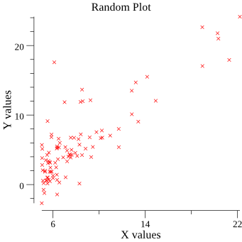

# go-plotting
Implementation of "just for func" gonum/plot tutorial by [Francesc Campoy](https://github.com/campoy).

### Overview
Plotting some data from a file using gonum/plot library.

### References:
- gonum: https://gonum.org
- gonum/plot docs: https://godoc.org/gonum.org/v1/plot

### Sample output
